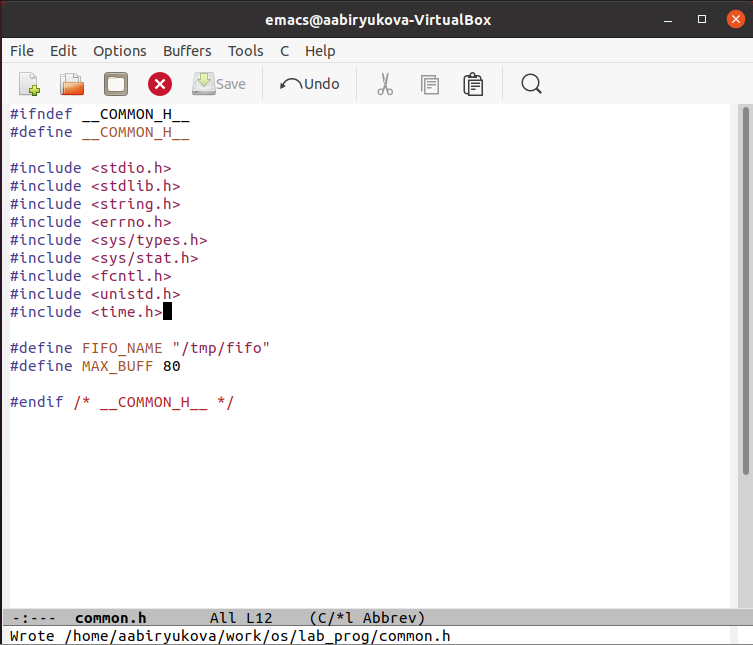
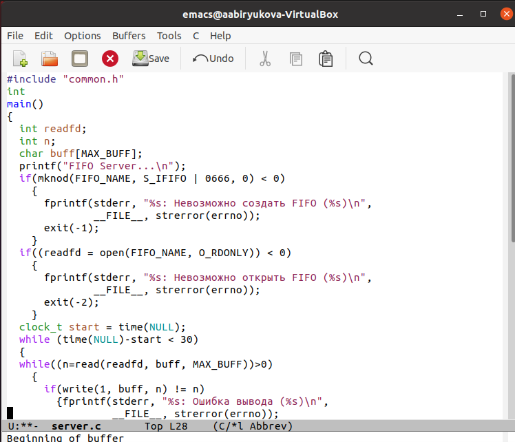
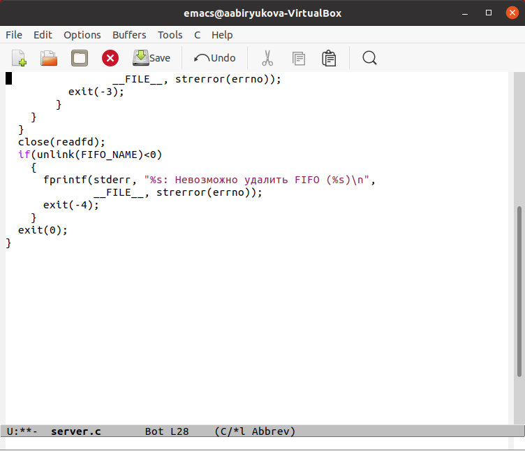
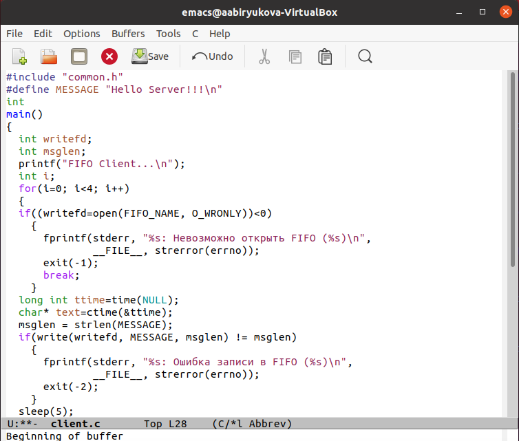
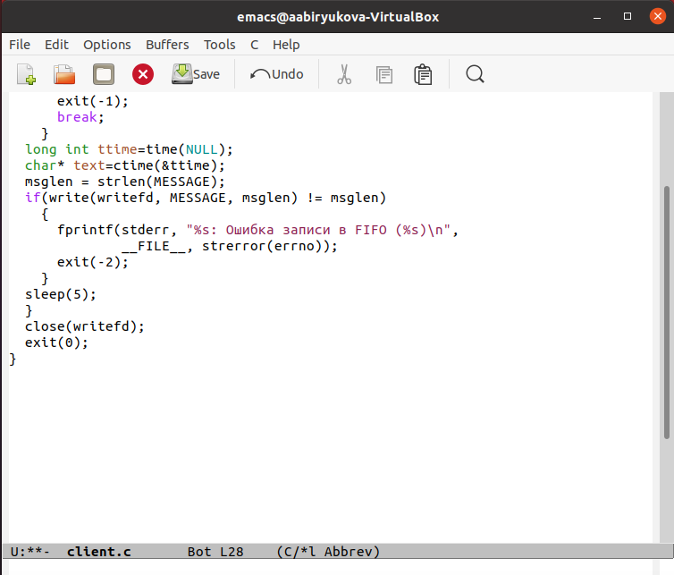
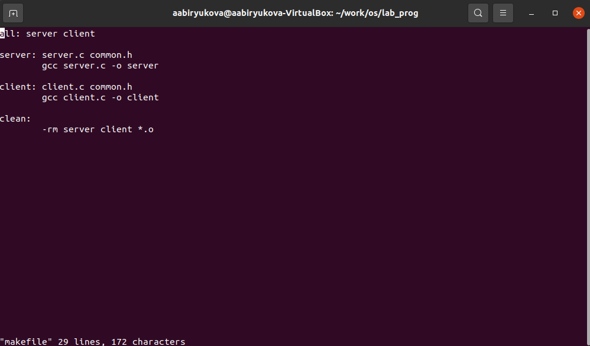
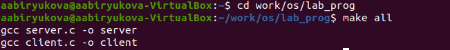
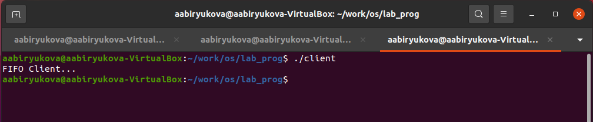
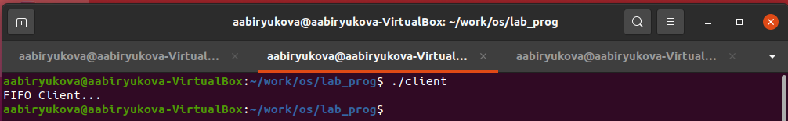
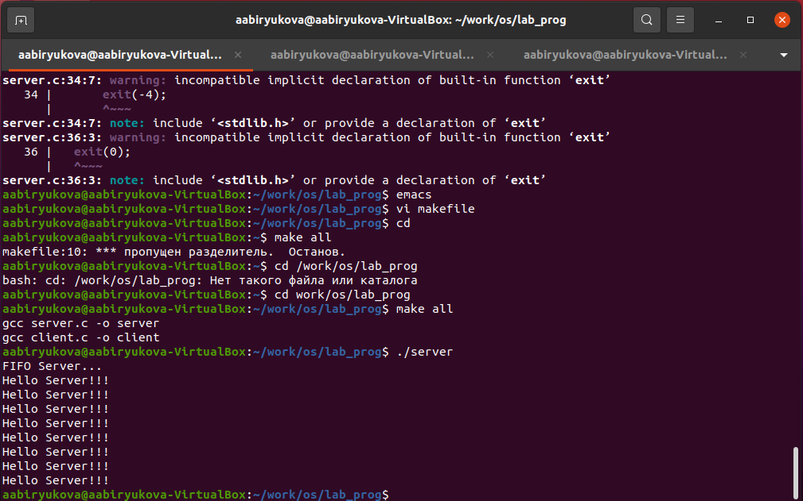

---
# Front matter
lang: ru-RU
title: "Отчёт по лабораторной работе №15"
subtitle: "Операционные системы"
author: "Бирюкова Анастасия Анатольевна"

# Formatting
toc-title: "Содержание"
toc: true # Table of contents
toc_depth: 2
lof: true # List of figures
lot: true # List of tables
fontsize: 12pt
linestretch: 1.5
papersize: a4paper
documentclass: scrreprt
polyglossia-lang: russian
polyglossia-otherlangs: english
mainfont: PT Serif
romanfont: PT Serif
sansfont: PT Sans
monofont: PT Mono
mainfontoptions: Ligatures=TeX
romanfontoptions: Ligatures=TeX
sansfontoptions: Ligatures=TeX,Scale=MatchLowercase
monofontoptions: Scale=MatchLowercase
indent: true
pdf-engine: lualatex
header-includes:
  - \linepenalty=10 # the penalty added to the badness of each line within a paragraph (no associated penalty node) Increasing the value makes tex try to have fewer lines in the paragraph.
  - \interlinepenalty=0 # value of the penalty (node) added after each line of a paragraph.
  - \hyphenpenalty=50 # the penalty for line breaking at an automatically inserted hyphen
  - \exhyphenpenalty=50 # the penalty for line breaking at an explicit hyphen
  - \binoppenalty=700 # the penalty for breaking a line at a binary operator
  - \relpenalty=500 # the penalty for breaking a line at a relation
  - \clubpenalty=150 # extra penalty for breaking after first line of a paragraph
  - \widowpenalty=150 # extra penalty for breaking before last line of a paragraph
  - \displaywidowpenalty=50 # extra penalty for breaking before last line before a display math
  - \brokenpenalty=100 # extra penalty for page breaking after a hyphenated line
  - \predisplaypenalty=10000 # penalty for breaking before a display
  - \postdisplaypenalty=0 # penalty for breaking after a display
  - \floatingpenalty = 20000 # penalty for splitting an insertion (can only be split footnote in standard LaTeX)
  - \raggedbottom # or \flushbottom
  - \usepackage{float} # keep figures where there are in the text
  - \floatplacement{figure}{H} # keep figures where there are in the text
---

# Цель работы

Приобретение практических навыков работы с именованными каналами.

# Задание

Научиться работать с именованными каналами

# Выполнение лабораторной работы

Для начала я создала необходимые файлы с помощью команды «touch» и открыла редактор emacs для их редактирования.(Рис.1-2)

Рис.1-2

Далее я изменила коды программ, представленных в тексте лабораторной
работы. В файл common.h добавила стандартные заголовочные файлы unistd.h и
time.h, необходимые для работы кодов других файлов. Common.h предназначен
для заголовочных файлов. (Рис3)

Рис3

В файл server.c добавила цикл while для контроля за временем работы сервера.
Разница между текущим временем time(NULL) и временем начала работы clock_t
start=time(NULL) (инициализация до цикла) не должна превышать 30 секунд (Рис4-5)

Рис4

Рис5

В файл client.c добавила цикл, который отвечает за количество сообщений о
текущем времени, и команду sleep для приостановки работы
(Рис6-7)

Рис6

Рис7

Makefile (Рис8)

Рис8

После написания кодов, я использовала команду «make all» и скомпилировала файлы (Рис9)

Рис9

Далее я проверила работу написанного кода. Открыла 3 консоли (терминала)
и запустила: в первом терминале − «./server», в остальных двух – «./client». 

В результате каждый терминал- клиент вывел сообщения. Спустя 30 секунд
работа сервера была прекращена. Программа работает без ошибок.

# Вывод
В ходе выполнения данной лабораторной работы я приобрела практические
навыки работы с именованными каналами.
